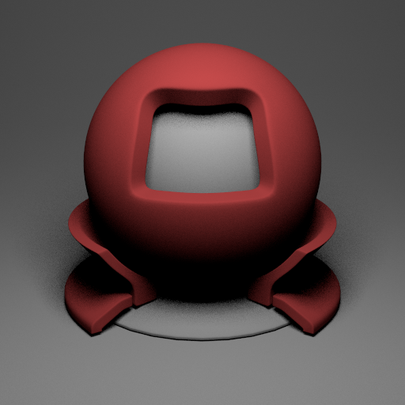
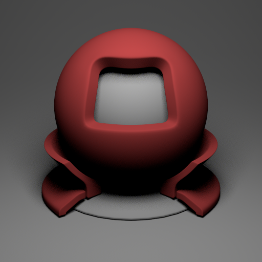
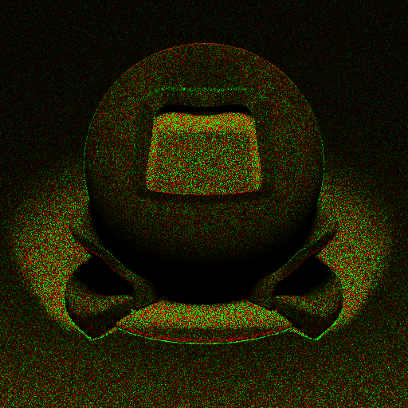
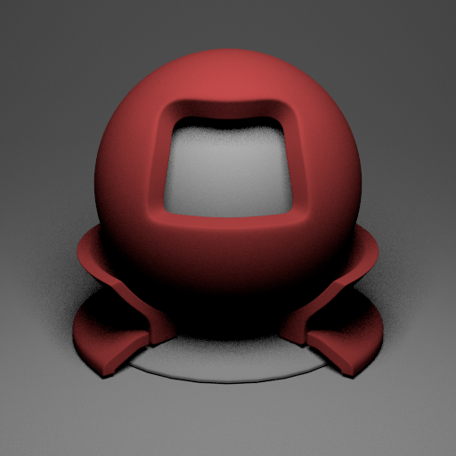
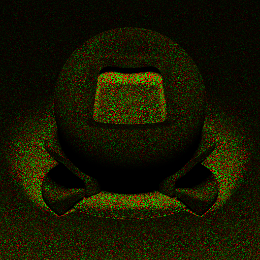

# Test de scène (PBRT 4, MTI882, Mitsuba 3)

Ce référentiel Git contient la scène de test pour les moteurs de rendu suivants :
- MTI882 (C++ ou Rust)
- PBRT 4 (C++)
- Mitsuba 3 (Python) _(* recommandé pour la comparaison)_

D'autre part, ce répertoire contient des outils pour éditez vos scènes ou faire la conversion de scènes.

Veuillez vous référer à la documentation pour la définition des matériaux : 
- [PBRT File Format v4 - Materials](https://pbrt.org/fileformat-v4#materials)
- [Mitsuba v3 - BSDFs](https://mitsuba.readthedocs.io/en/latest/src/generated/plugins_bsdfs.html)

Les images pour le diffus se trouve dans le dossier `images`.

## Script merge materiaux

Le script `script/merge_materials.py`` permet de fusionner des fichiers de matériaux pour permettre d'editer plus facilement vos fichiers JSON. Voici comment utiliser le script:

```bash
usage: merge_materials.py [-h] base_file merge_file output_file

positional arguments:
  base_file
  merge_file
  output_file

options:
  -h, --help   show this help message and exit
```

Les parametres:
- `base_file`: le fichier de base à prendre (format JSON)
- `merge_file`: le fichier des BSDFs que l'on veut modifier
- `output_file`: fichier de sortie

**Attention:** Soyez vigilant quant aux messages affichés dans la console lors de l'exécution du script. 

```bash
python ./script/merge_materials.py ./test00001.json ./script/modified.json out.json
```

## MTI882

Pour éditer le matériau, ouvrez `test00001.json` et éditez le premier matériau (ligne 19) nommé "case".

Rendu MTI882: 



## PBRT-v4

Code: https://github.com/mmp/pbrt-v4
```bash
git clone --recursive https://github.com/mmp/pbrt-v4.git
```

Pour éditer le matériau, ouvrez `test00001.pbrt` et éditez le premier matériau (ligne 26) nommé "case".

**Problèmes connus**
- Décalage potentiel des textures

Rendu PBRT-v4:



Comparaison avec MTI882:




### Mitsuba 3 

Installation et génération. Vous devez avoir Python installer sur votre systeme. 
```bash
pip install --user mitsuba
python mitsuba3.py --scene test00001.xml --output out.exr
```

Pour éditer le matériau, ouvrez `test00001.xml` et éditez le premier matériau (ligne 27) nommé "case".

Rendu Mitsuba 3:



Comparaison avec MTI882:




### Script conversion MTI882 -> Mitsuba3

```bash
python ./script/convert_mts3.py --input ./test00001.json --output test.xml
```

**Limitations:**
- Ne supporte pas les textures
- Assume que la scène à été exportée depuis Blender
- Uniquement le support de diffus et area lights


